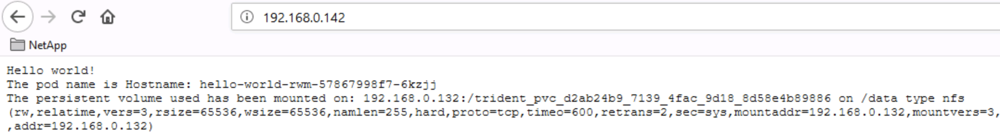
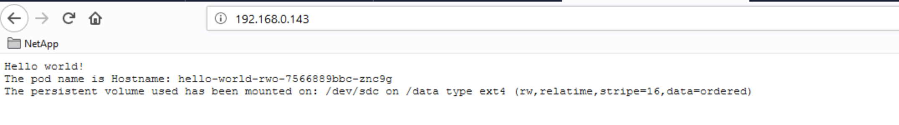

# Demo Trident
Guide to show some features and advantages to use ONTAP as a backend storage for Kubernetes and OpenShift using the last NetApp Lab on Demand [Using Trident with Kubernetes and ONTAP](https://labondemand.netapp.com/products/trident-docker-and-kubernetes). This repository includes some scripts and Ansible playbooks to customize the lab. The demo is shown in 6 sections:

* [Module 1: Deployment & Provisioning](#module-1-deployment--provisioning)
* [Module 2: Kubernetes Storage Provisioning with Trident 101](#module-2-kubernetes-storage-provisioning-with-trident-101)
* [Module 3: New tier application architecture with Kubernetes](#module-3-new-tier-application-architecture-with-kubernetes)
* [Module 4: Advanced NetApp Trident features](#module-4-advanced-netapp-trident-features)
* [Module 5: Configuration Management](#module-5-configuration-management)
* [Summary](#summary)

## Making the demo

Open the putty console and connect to the kubernetes master node root@rhel3. Run the below commands:

```shell
git clone https://github.com/pablogarciaarevalo/demo-trident
cd demo-trident/making
chmod 744 *.sh
. ./configure_demo.sh
cd ../demo/
```

Open the slides in the browser http://rhel6.demo.netapp.com/demo.pdf.

## Module 1: Deployment & Provisioning

### Show the demo kubernetes cluster

- Objetive: Show the kubernetes cluster in order to understand the demo.

> Go to slide 2

Run the below command:

```shell
kubectl get nodes -o wide
```

### Ansible phases days 0 & 1: Deployment & Provisioning

- Objetive: An Infrastructure as a Code software like Ansible is needed to automate when using Kubernetes. Ansible Phases 0 & 1 automates device bring up.

> Go to slide 3

Run the below commands and explain the Ansible playbook to automate the ONTAP provisioning:

```shell
./01_iaac_ansible_day0-1.sh
```

## Module 2: Kubernetes Storage Provisioning with Trident 101

### Install NetApp Trident

- Objetive: Show the steps to deploy NetApp Trident.

> Go to slide 4

Run the below command:

```shell
./02_install_trident.sh
```

### Create NetApp Trident backend

- Objetive: A Trident backend defines the relationship between Trident and a storage system. It tells Trident how to communicate with that storage system. Tasks to do by the IT Storage Administrator.

Run the below command:

```shell
./03_create_k8s_backends.sh
```

### Show the Kubernetes Storage Classes

- Objetive: A StorageClass provides a way for administrators to describe the 'classes' of storage they offer. Different classes might map to quality-of-service levels, or to backup policies, or to arbitrary policies determined by the cluster administrators. Trident moves the ONTAP's advantages to the containers and kubernetes solutions.

Run the below commands:

```shell
./04_create_k8s_storageclasses.sh
```

### Dynamic Kubernetes Persistent Volumes Provisioning with Trident

- Objetive: Persistent Volume Claims (or PVCs) are objects that request storage resources from a cluster. It shows how to run Read Write Many Persistent Volumes and Read Write Once Persistent Volumes.

| PV Access Modes | Abbreviated |    Volume    | As known as |
| --------------- |:-----------:| ------------ | ----------- |
|  ReadWriteMany  |     RWX     |      NFS     |     NAS     |
|  ReadWriteOnce  |     RWO     | iSCSI or NFS |  NAS or SAN |
|  ReadOnlyMany   |     ROX     | iSCSI or NFS |  NAS or SAN |

> Go to slide 5

Run the below command:

```shell
./05_create_pvc.sh
```

### Create Pods and bind the previous Persistent Volumes

- Objetive: Show how to bind RWM and RWO Persistent Volumes to a PODs. Show how the volumes are mounting.

> Go to slide 6

Run the below command, noting that the YAML files are scheduling manually the Pods in the node rhel1 instead of using the kubernetes scheduler.

```shell
./06_create_apps.sh
```
Open a browser http://192.168.0.142 to show the POD mounting the previous Read-Write-Many Persistent Volume.



Open a browser http://192.168.0.143 to show the POD mounting the previous Read-Write-Once Persistent Volume.



## Module 3: New tier application architecture with Kubernetes

### Sample cloud-native application with 10 microservices by GCP 

- Objetive: Data storage is not really important, the applications are. But Trident with the NetApp storage provides some advantages with the ONTAP features that allows the application works better (efficiency, scale, security, portability,...).

> Go to slide 7

Set focus on the microservices Frontend and Cache (Redis), which can use RWM PV and RWO PV respectively. Again, K8s needs unified storage.

### Kubernetes controllers: Deployment vs StatefulSet

- Objetive: Explain the differences between Deployment and StatefulSet. Like a Deployment, a StatefulSet manages Pods that are based on an identical container spec. Unlike a Deployment, a StatefulSet maintains a sticky identity for each of their Pods. These pods are created from the same spec, but are not interchangeable: each has a persistent identifier that it maintains across any rescheduling.

> Go to slide 8

StatefulSet keys:
- Stable, unique network identifiers
- Stable, persistent storage
- Ordered, graceful deployment and scaling
- Ordered, automated rolling updates


### Create Kubernetes applications based on a 3-Tier architecture

- Objetive: Show how to create and scale a frontend deployment accessing a single Read-Write-Many Persistent Volume (NFS) and create and scale a backend statefulset accessing several Read-Write-Once Persistent Volume (iSCSI). 

> Go to slide 9

Run the below commands:

```shell
./07_todo_app_3tier.sh

kubectl get pods,pvc -n todo-app
kubectl get pv
```

Scaling the frontend deployment:

```shell
kubectl scale --replicas=2 deployment todo-app-3tier-web -n todo-app
kubectl get pods,pvc -n todo-app
```

Scaling the backend statefulset:

```shell
kubectl scale --replicas=2 statefulset todo-app-3tier-backend -n todo-app
kubectl get pods,pvc -n todo-app
```

## Module 4: Advanced NetApp Trident features

### Volume Import

- Objetive: Explain the Trident Volume Import feature and some use cases. The demo shows a legacy website with the content in a NetApp NFS volume, and the procedure to import the webpage in Kubernetes as a pod. **Note that the demo shows a website to understand it better but consider a database**.

> Go to slide 16 and 17

Open a browser http://rhel6.demo.netapp.com/


Run the below commands:

```shell
./12_import_web_service.sh

kubectl get pvc -n web
```

Run the below command to get the kubernetes services IP address:

```shell
kubectl get all -n web
```

Open a browser http://192.168.0.142

> Go to slide 18

Scale the statefulset:

```shell
kubectl scale --replicas=3 statefulset web-prod -n web
```

### Decoupling application and data with external storage

- Objetive: Kubernetes stateful applications are based on yaml files and persistent volumes. Using an external data storage allows to decoupling application and data. In case a failure, the service can be restored safely and quickly importing the persistent volumes and applying the yaml files. The most common cause of data and service lost is the human error. For instance, kubernetes doesn't request a --force flag or similar to delete a non-empty namespace (https://github.com/kubernetes/kubectl/issues/525).

Run the below commands:

```shell
kubectl delete namespace web
kubectl get all -n web
kubectl get pvc --all-namespaces
```

Open a browser http://192.168.0.142

Having an external storage allows us to restore the service easily. Run the below commands:

```shell
./13_restore_web_service.sh
kubectl get all -n web
```

Open a browser http://192.168.0.142

### Kubernetes Volume Snapshots

- Objetive: The container storage interface (CSI) is a standardized API for container orchestrators to manage storage plugins. NetApp Trident has been deployed a CSI plugin. Kubernetes 1.12 includes Volume Snapshots as a Alpha, and Kubernetes 1.17 does it as a Beta. This is CSI, but if you are using ONTAP you can have up to 1023 Snapshots per volume.

> Go to slide 19

### Kubernetes Persisten Volume Claim from Snapshot (aka Clone)

- Objetive: Note that right now, up to kubernetes 1.17, a Volume snapshot can not be restored. What can we do with a volume snapshot? Cloning.

> Go to slide 20

### Use case 1 for clone

- Objetive: Data pipeline for Kubeflow. Data Engineer preparing the data with SMB/NFS

> Go to slide 21

```shell
./14_datalake_clone.sh

kubectl get pvc -n data-analytics
```

> Go to slide 22

```shell
./15_data_analytics_services.sh

kubectl get all -n data-analytics
```
### Use case 2 for clone

- Objetive: Coming to the previous web example. Cloning for dev/staging using Rest API

> Go to slide 23

```shell
./16_clone_web.sh
```

> Go to slide 24

__**GO TO SECOND K8S CLUSTER (root@rhel4):**__

```shell
cd demo-trident/demo/
./17_create_staging_web_service.sh
kubectl get all -n web
```

Open a browser http://192.168.0.150

```shell
./18_coding_new_website.sh
```

Open a browser using incognito mode http://192.168.0.150


## Module 5: Configuration Management 

### Ansible phase 2: Configuration Management

- Objetive: Ansible Phases 2 optimizes compliance and operation.

> Go to slide 25

__**GO BACK TO THE FIRST K8S CLUSTER (rhel3)**__ and run the below command:

```shell
./19_iaac_ansible_day2.sh
```

Run the below command to show the volume protection with SnapMirror:

```shell
./20_get_protection_volumes.sh
```

## Summary

- Objetive: Explain all the tasks done and resume the advantages of use NetApp storage

> Go to slide 26

Open a browser http://192.168.0.141 (user: admin / password admin)

Skip to change the password and choose the Trident dashboard.
